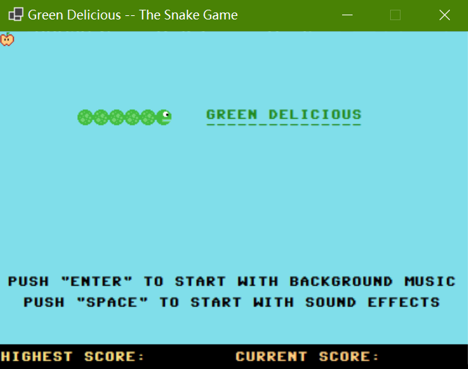
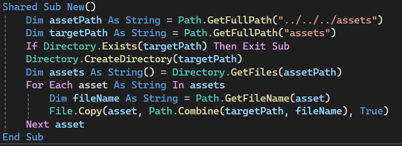

# Green Delicious -- The Snake Game 

This mini-game is carefully written for three days as a WinForms project.

Basic code of the project was provided by artificial intelligence, but after that
I was dedicated to enriching and refactoring code, and therefore the A.I. only did
a small part of the entire project.

The only limitation of this project is that the background music and the sound
effects can't be played simutaneously, owing to the SoundPlayer class.

__The project's executable can be found in the path: ./bin/Debug/net7.0-windows/__

### Latest Update:

It's not until today that I could find the disadvantage of locating the "assets"
folder only by means of its relative path, so I've added the *__shared constructor__*
to the "frmMain" class as follows, which copies the whole folder to the directory of
the executable. _Accessing the game assets are made easier for the Winforms project_
_thanks to such a trick, for my part._

